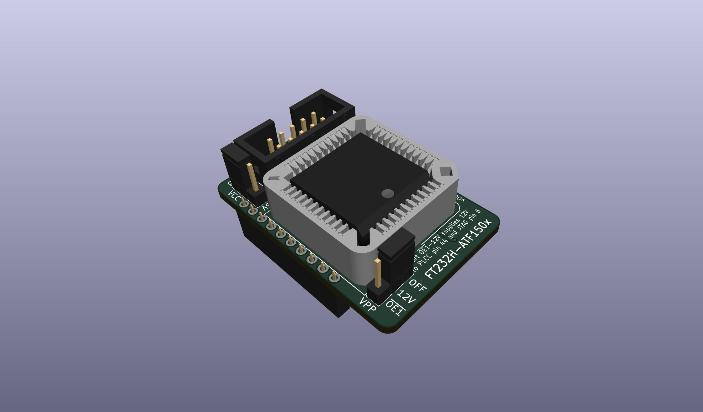
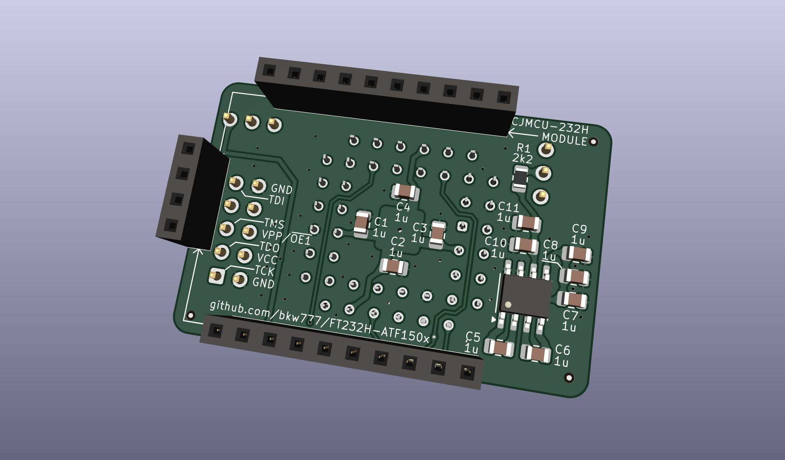
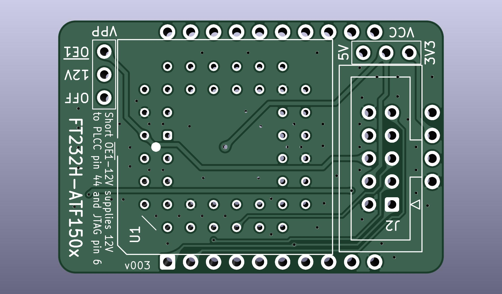
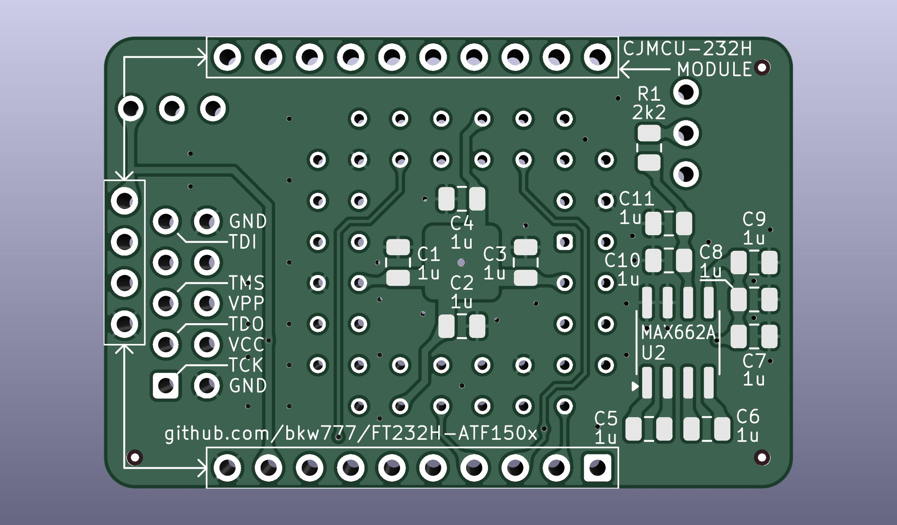
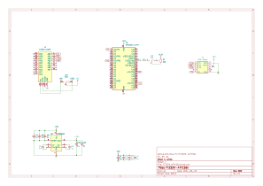

# FT232H-ATF150x Programmer

Adapter PCB that plugs onto a common "CJMCU-232H" FT232H USB module to make a programmer for ATF150x CPLDs.

Includes a 12v supply for VPP on /OE1 to recover CPLDs that have JTAG disabled.

To use the on-board 12V VPP supply to unlock a JTAG-connected device instead of the PLCC socket, connect a "dupont" wire from the center pin on the VPP jumper pin header to /OE1/VPP on your device in addition to the JTAG cable.

Optional VPP-over-JTAG:  
JTAG pin 6 wich is normally NC, is connected to /OE1.  
This has no effect if the VPP jumper is set to OFF.  
If the VPP jumper is set to /OE1, then 12V is supplied to both PLCC-44 Socket pin 44 and JTAG pin 6.  
[bkw777/ATF150x_uDEV](https://github.com/bkw777/ATF150x_uDEV) includes a matching option to receive VPP on JTAG pin 6.

# Credits
Modified from [hackup.net ATF1504-FT232HQ Shield](https://www.hackup.net/2020/01/erasing-and-programming-the-atf1504-cpld/)

