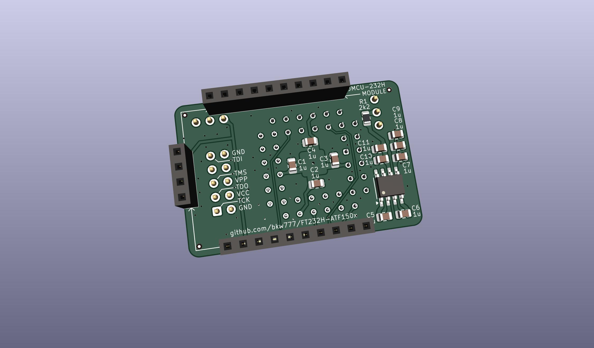

# ATF150x Programmers based on FT232H modules

ATF150x programmer in the form of a "hat" PCB for common FT232H USB modules like CJMCU-232H or Adafruit 2264.

Includes a 12V supply for VPP on /OE1 to recover CPLDs that have JTAG disabled.

To use the on-board 12V VPP supply to unlock a device connected by JTAG instead of the PLCC socket, connect a "dupont" wire from the 12V pin on the VPP jumper pin header to /OE1/VPP on your device in addition to the JTAG cable.

## Optional VPP-over-JTAG
JTAG pin 6 is connected to /OE1.  
When the VPP jumper is set to /OE1, then 12V is supplied to both PLCC-44 Socket pin 44 and JTAG pin 6.  
[bkw777/ATF150x_uDEV](https://github.com/bkw777/ATF150x_uDEV) includes a matching option to receive VPP on JTAG pin 6.

When the VPP jumper is set to OFF, the /OE1 connection has no effect and the JTAG port is the same as any other [Altera JTAG-A](PCB/datasheets/JTAG-A.pfd) port.  
Even when VPP is enabled, it will still usually have no effect on JTAG, since pin 6 is not used and not connected to anything on most devices and programmers.  
But 12V is 12V, so **Don't enable VPP with an unknown device connected to JTAG**  

# Credits
Modified from [hackup.net ATF1504-FT232HQ Shield](https://www.hackup.net/2020/01/erasing-and-programming-the-atf1504-cpld/)
