# ATF150x Programmers based on FT232H modules

ATF150x programmer in the form of a "hat" PCB for common FT232H USB modules like CJMCU-232H or Adafruit 2264.

Includes a 12V supply for VPP on /OE1 to recover CPLDs that have JTAG disabled.

There are 2 versions. Both versions provide:  
* FT232H
* 10-pin JTAG port with ATMEL/ALtera JTAG-A pinout
* 12V power supply for VPP
* Optional 12V VPP out on JTAG pin 6
* JTAG VCC switchable:
  * programmer supplies 3V3 VCC to target
  * programmer supplies 5V VCC to target
  * target supplies own VCC

----

## Adafruit 2264  
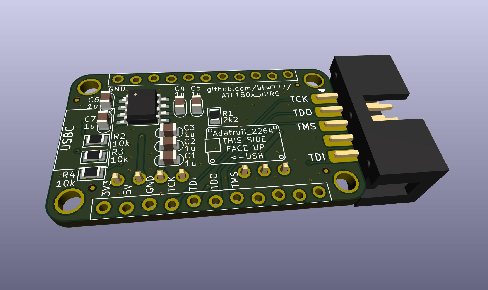
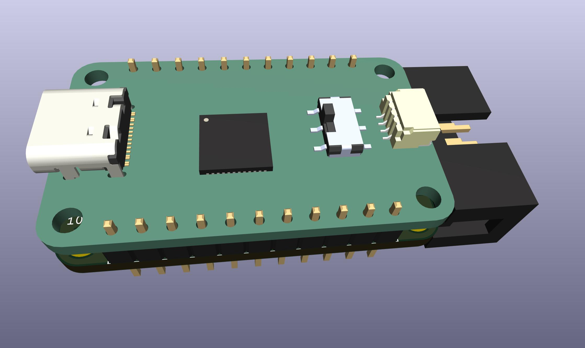
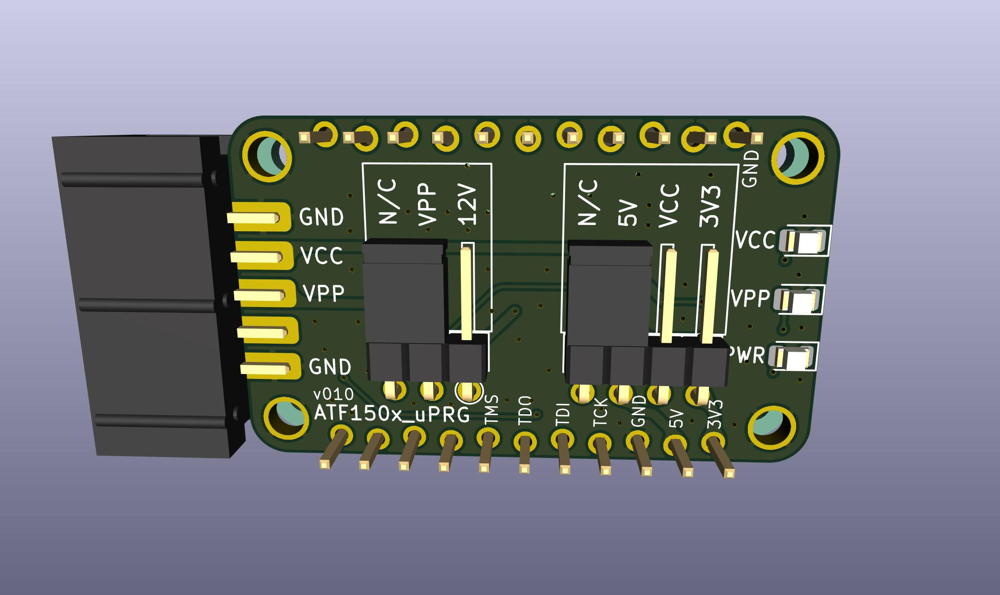
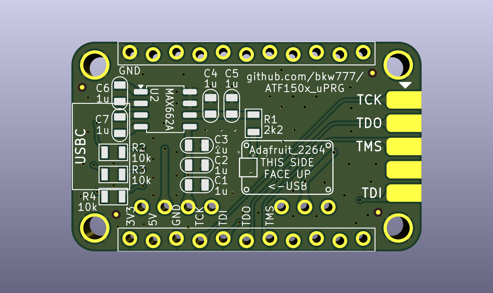
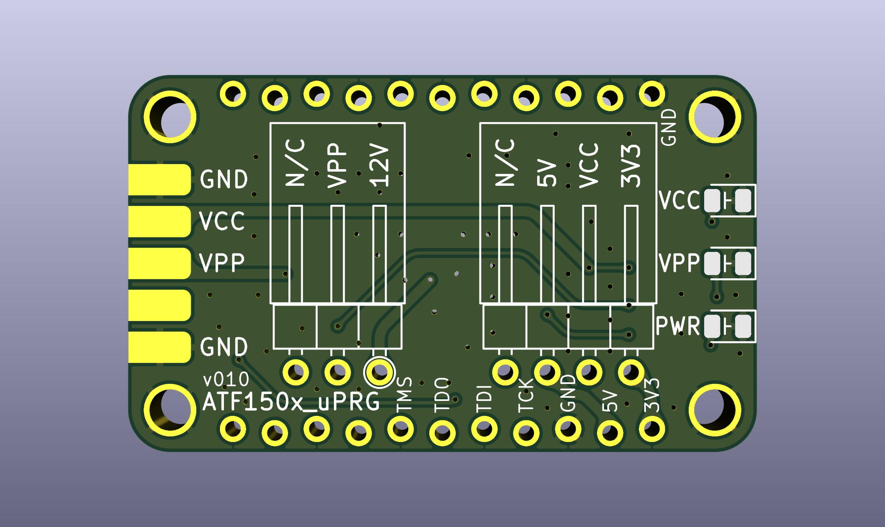

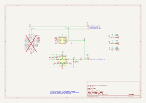

[v010 PCB at OSHPark](https://oshpark.com/shared_projects/TQWUH0NG)  
[BOM @ DigiKey](https://www.digikey.com/short/crp904w2)  
(includes the Adafruit 2264 and 2 types of JTAG cable)
<!-- _sw version with slide switches and 33 ohms on the jtag lines
https://www.digikey.com/short/nvr0cz3h
-->
Cover [ATF150x_uPRG.stl](COVER/out/ATF150x_uPRG.stl)

----

## CJMCU-232H  
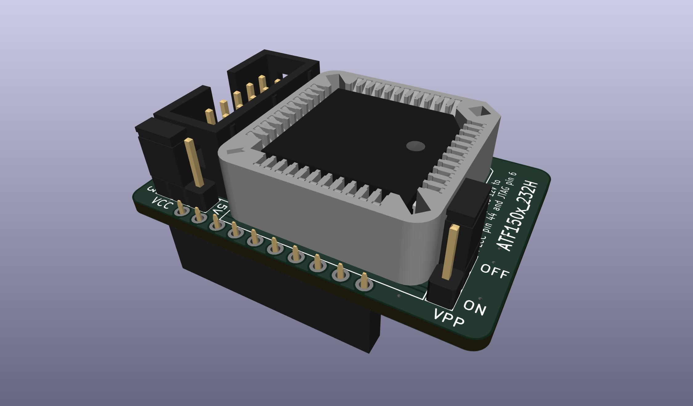
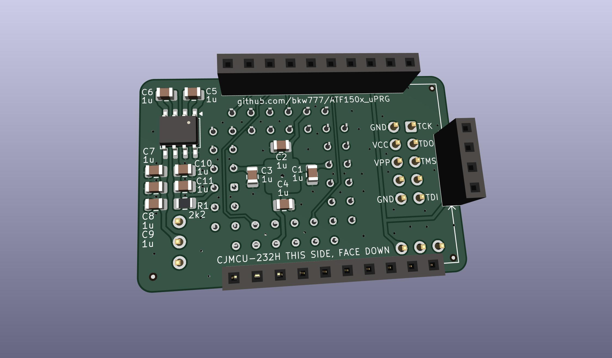

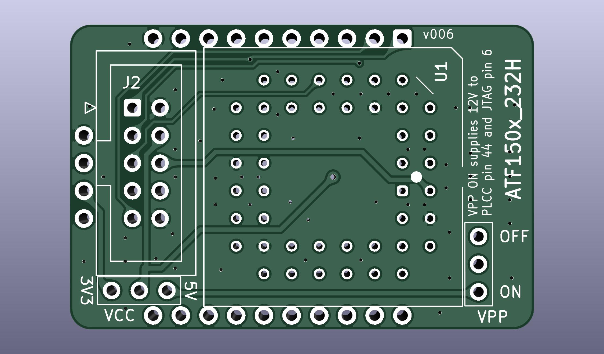
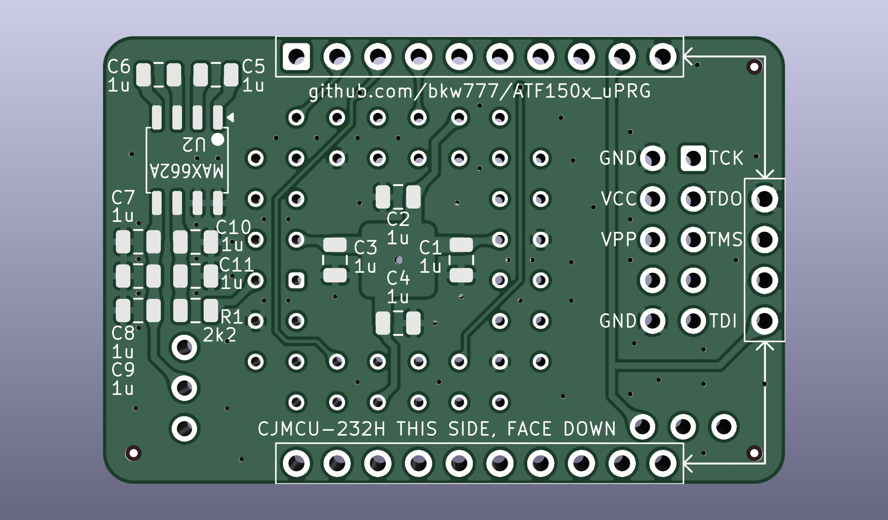
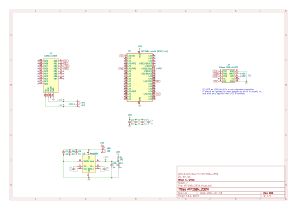

----

## VPP-over-JTAG
When the VPP jumper or switch is ON, 12V is supplied to JTAG pin 6 (and PLCC pin 44 on the CJMU-232H)  
This forces the ATF150x to enable it's JTAG pins even if the current gateware disabled JTAG to use those pins for GPIO.  
VPP does NOT overcome the secure programming flag.  

[ATF150x_uDEV](https://github.com/bkw777/ATF150x_uDEV) includes a matching option to receive VPP on JTAG pin 6.
  
JTAG pin 6 should be N/C on most Altera JTAG-A targets, so it should be safe even for other devices, but 12V is 12V, so **Don't enable VPP with an unknown device connected to JTAG**  

# Credits
Modified from [hackup.net ATF1504-FT232HQ Shield](https://www.hackup.net/2020/01/erasing-and-programming-the-atf1504-cpld/)
