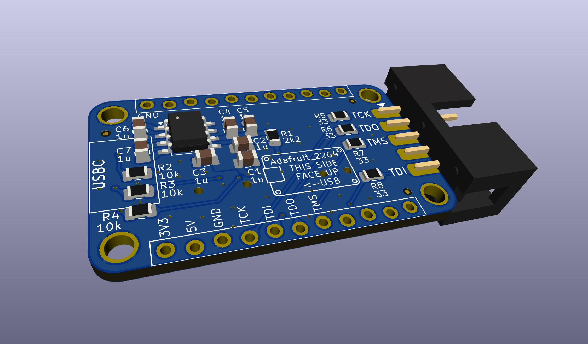
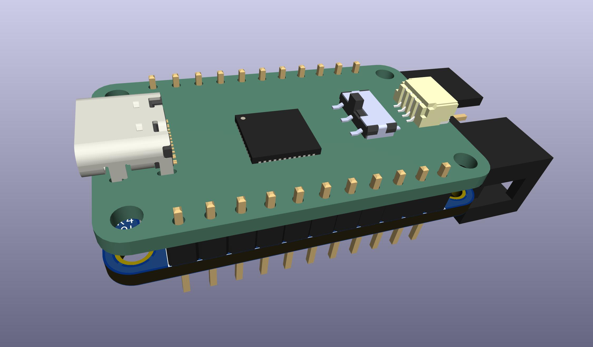
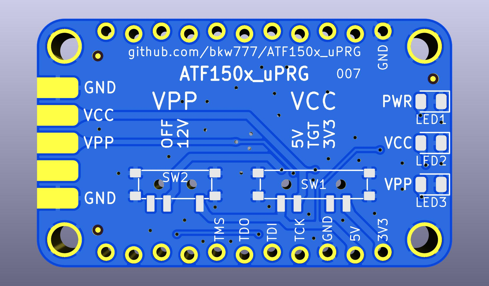
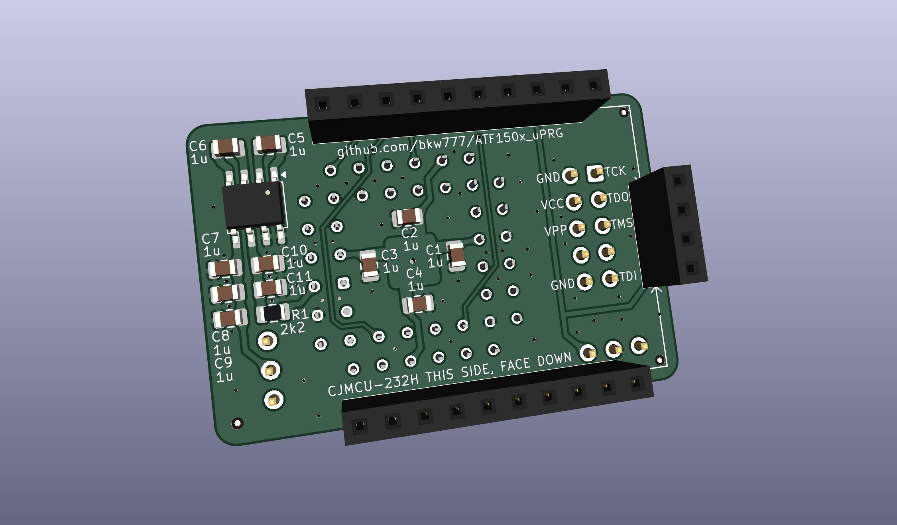

# ATF150x Programmers based on FT232H modules

ATF150x programmer in the form of a "hat" PCB for common FT232H USB modules like CJMCU-232H or Adafruit 2264.

Includes a 12V supply for VPP on /OE1 to recover CPLDs that have JTAG disabled.

There are 2 versions. Both versions provide:  
* FT232H
* 10-pin JTAG port with ATMEL/ALtera JTAG-A pinout
* 12V power supply for VPP
* Optional 12V VPP out on JTAG pin 6
* JTAG VCC switchable:
  * programmer supplies 3V3 VCC to target
  * programmer supplies 5V VCC to target
  * target supplies own VCC

The Adafruit 2264 version:  
* USB-C
* Connect to 2264 without sockets
* Slide switches to select options
* Leds to show USB, VCC, VPP
* 33 ohm resistors on JTAG data lines
* Smaller

The CJMCU-232H version:  
* USB-A
* PLCC-44 socket
* Jumpers to select options
* Cheaper (232H board from aliexpress)

## Adafruit 2264  

DigiKey BOM (including the Adafruit 2264 and JTAG cable): https://www.digikey.com/short/pd883vn2

## CJMCU-232H  

## VPP-over-JTAG
When VPP is ON, 12V is supplied to JTAG pin 6 and PLCC pin 44.  
This forces the JTAG pins to be enabled even if the device is currently programmed with the JTAG pins disabled (used as ordinary I/O pins).

[ATF150x_uDEV](https://github.com/bkw777/ATF150x_uDEV) includes a matching option to receive VPP on JTAG pin 6.
  
JTAG pin 6 should normally be NC for most Altera JTAG-A targets, but 12V is 12V, so **Don't enable VPP with an unknown device connected to JTAG**  

# Credits
Modified from [hackup.net ATF1504-FT232HQ Shield](https://www.hackup.net/2020/01/erasing-and-programming-the-atf1504-cpld/)
